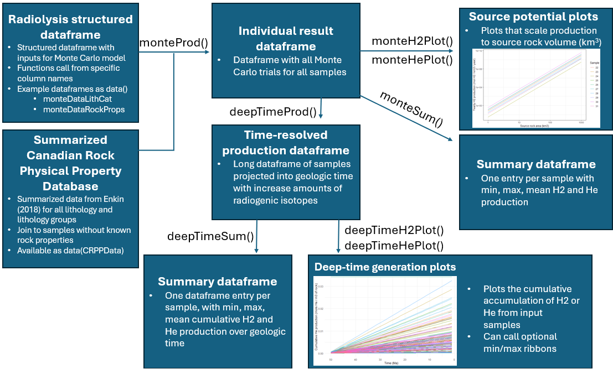

# Radiolysis
Steamlined Monte Carlo modelling to assess naturally occurring hydrogen and helium in R.

## Description

'Radiolys' is a R package that performs the Monte Carlo model of [Warr et al. (2023)](https://www.frontiersin.org/journals/earth-science/articles/10.3389/feart.2023.1150740/full) and extends this work by incorporating plots and modelling tools to assess the size and accumulation of potential hydrogen/helium deposits similar to petroleum systems. The goal is to provide a streamlined approach to take lithogeochemical data and assess it for hydrogen or helium potential. This is achieved through two main functions, 1) monteProd() - producing a Monte Carlo model of input samples, and 2) deepTimeProd() - backward projecting the production rates into deep time (millions of years) to assess accumualted potential. Both functions have plotting and summarization functions to digest the production models.  



This work was done as part of Geological Survey of Canada reserach on naturally occurring hydrogen and helium in the subsurface and is published in JOSS at -linkTBD-.

## Requirements

- ggplot
- dplyr

## Installation
```
install.packages("devtools")
install_github("NRCAN/h2Rad")
library(Radiolysis)
```

## License
The Radiolysis package is published under CC BY-NC license. For commercial licensing opportunities regarding the 'Radiolysis' package, please contact Natural Resources Canada’s Intellectual Property Division at: ipd-dpi@nrcan-rncan.gc.ca 
