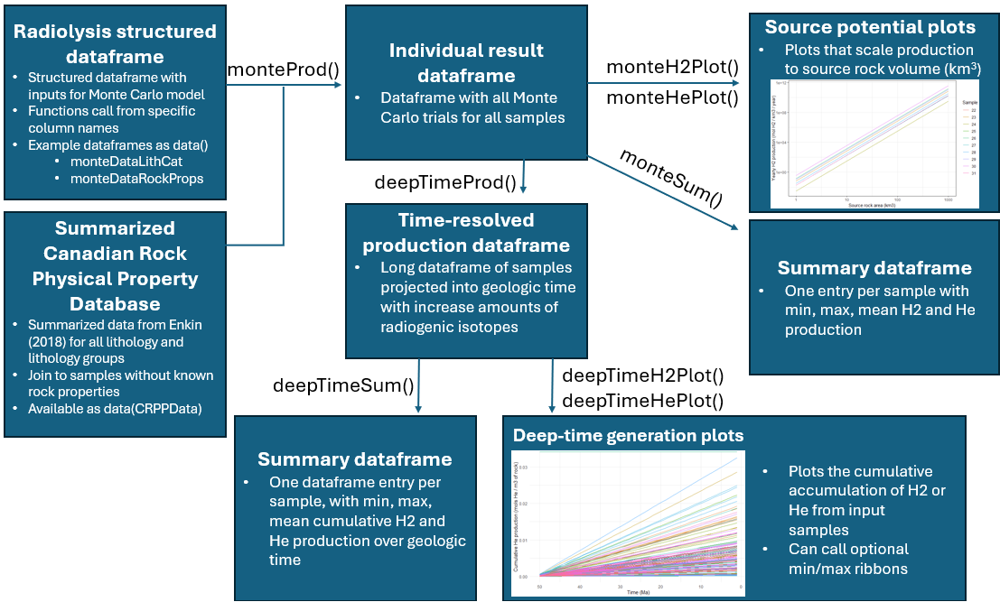

--- 
title: 'Radiolysis: Monte Carlo model for estimating H2 and He production through radiolysis'
tags:
  - R
  - geology
  - hydrogen
  - helium

authors:
  - name: Daniel S. Coutts
    corresponding: true 
    affiliation: 1
  - name: Oliver Warr
    affiliation: 2
  - name: Omid H. Ardakani
    affiliation: 1
  - name: Barbara Sherwood Lollar
    affiliation: 3

affiliations:
 - name: Natural Resources Canada - Geological Survey of Canada - Calgary
   index: 1
- name: University of Ottawa, Canada
   index: 2
 - name: University of Toronto, Canada
   index: 3
date: August 12, 2025
bibliography: paper.bib
--- 

# Summary
Naturally occurring hydrogen (H2) in the Earth’s subsurface represents a novel source of H2 for use in electricity generation and hard-to-abate industrial processes (e.g., ammonia, fertilizer, steel) [@IEA:2024; @Ballentine:2025; @Johnson:2025; @SherwoodLollar:2025]. Helium (He), meanwhile, is a critical non-renewable resource utilized in medical, industrial, and research fields [@Warr:2019; @Danabalan: 2022; @Cheng:2023]. With a growing list of H2 and He showings in different geological settings [@SherwoodLollar:2014; @Danabalan:2022; @Miaga:2023; @Truche:2024] along with focused exploration for these gases [@Jackson:2024; @Ballentine:2025; @Hu:2025], new tools are required to prospect for and model these emerging resources. Natural H2 is produced through two dominant geologic processes [@SherwoodLollar:2014; @Ballentine:2025], radiolysis [Lin:2005; @Warr:2023; @Higgins:2025] and serpentinization [Coveney:1987]. Radiolytic H2 is generated when ionizing α, β, and γ particles from U, Th, K-bearing minerals breaks water into H2 and O ions. It is important to note that released alpha particles are equivalent to helium-4 atoms and the breakdown of U and Th-bearing minerals is a dominant process for the generation of helium in the subsurface. H2 formation through serpentinization requires the release of H2 due to the alteration of ultramafic rocks to serpentine in the presence of water [@SherwoodLollar:2014; @Ballentine:2025]. Current modelling of these processes is not accessible or focused on economic assessment of potential resources. To partially fill this gap in resource estimation tools, `Radiolysis` provides fast and efficient Monte Carlo modelling of H2 and He production rates, following the radiolysis quantification methods of @Warr:2023. This implementation of the previously unpublished methods provides a rapid way to digest a large number of lithogeochemical samples to understand their H2 and/or He prospectivity over geological time scales. 
# Statement of need
New resource modelling tools are urgently required to explore for He and for natural H2, given their emerging and critical role in low-carbon energy generation and in research, medical, industrial processes [@Danabalan:2022; @Jackson:2024; @IEA:2024; @SherwoodLollar:2025]. `Radiolysis` provides this by 1) calculation of H2 and He production rates via radiolysis from rock properties; 2) backward projecting these generation rates into deep time; 3) summarization and plotting of results, including novel plotting focused on resource-estimation metrics. These functions provide the foundation for basin modelling for radiolysis-dominated H2 systems similar to exploration for hydrocarbon systems (Figure 1). 
The Monte Carlo approach follows the equations of @Warr:2023, incorporating truncated normal distributions (controlled by min, max, mean, and standard deviation inputs) for sample geochemistry (U, Th, and K concentrations), sample physical properties (rock density and porosity), and fluid properties (fluid density) (Table 1). The approach is programmed in R to rapidly handle multiple input samples. Rock properties (porosity, density) can be user defined, however, if rock properties are unknown, then summarized rock properties can be joined to samples from The Canadian Rock Physical Property Database [@Enkin:2018], based on the known lithology. Inputs into the models are always treated as a Monte Carlo distribution, however if a single deterministic model is desired, standard deviation of any model parameter can be set to zero. 
To assess cumulative volumes of H2, and He produced through radiolysis over geologic time periods, `Radiolysis`can project these processes backwards through geologic time. The Monte Carlo models described above are projected, taking into account the combined radiogenic decay of U, Th, and K. These production rates can then be summed to determine the cumulative production over the specified time interval (Figure 2).
Overall, functions in `Radiolysis` provide a straight-forward modelling of multiple samples from a single structured dataframe to data summaries that inform exploration (Figure 1). Functions include: 1) preforming the Monte Carlo modelling as an R function, ingesting data as a structured dataframe (Table 1); 2) summarizing  Monte Carlo results and plotting novel source-volume-scaling plots (Figure 2a); 3) backwards projecting Monte Carlo models into geologic time by calculating cumulative volumes (Figure 2b). Source-rock-volume-scaling plots are a simple yet important development, which allows for prospecting natural H2 and He from lithogeochemical samples, or modelling H2 systems similar to what gas traditionally been done for hydrocarbon systems. Example data include dataframes structured for Monte Carlo model input (with and without known rock properties) and the summarized data from The Canadian Rock Physical Property Database [@Enkin:2018] (Figure 1). `Radiolysis` will hopefully aid in the understanding of the subsurface hydrogen and helium systems and streamline its exploration.

#### Table 1: Example layout of structured dataframe required for input into Radiolysis monteProd() function. The function data from the input dataframe by column name (e.g., $uMin, $rockDenMax), as such column names must match exactly. 

|Dataframe column | Type        | Description                                                                                            |
|:------------------------:|:-----------:|:-----------------------------------------------------------------------:|
|Sample | Numeric | Sample name |
|uMin |Numeric|Minimum of modelled uranium concentration distribution (ppm)|
|uMax |Numeric|Maximum of modelled uranium concentration distribution (ppm)|
|uMean|Numeric|Mean of modelled uranium concentration distribution (ppm)|
|uSD|Numeric|Standard deviation of modelled uranium concentration distribution (ppm)|
|thMin |Numeric|Minimum of modelled thorium concentration distribution (ppm)|
|thMax |Numeric|Maximum of modelled thorium concentration distribution (ppm)|
|thMean|Numeric|Mean of modelled thorium concentration distribution (ppm)|
|thSD|Numeric|Standard deviation of modelled thorium concentration distribution (ppm)|
|kMin |Numeric|Minimum of modelled potassium concentration distribution (wt%)|
|kMax |Numeric|Maximum of modelled potassium concentration distribution (wt%)|
|kMean|Numeric|Mean of modelled potassium concentration distribution (wt%)|
|kSD|Numeric|Standard deviation of modelled potassium concentration distribution (wt5)|
|fluDenMin |Numeric|Minimum of modelled fluid density distribution (g/cm3)|
|fluDenMax |Numeric|Maximum of modelled fluid density distribution (g/cm3)|
|fluDenMean|Numeric|Mean of modelled fluid density distribution (g/cm3)|
|fluDenSD|Numeric|Standard deviation of modelled fluid density distribution (g/cm3)|
lithLith|String|Lithologiy/category of desired rock properties from Canadian Rock Physical Property Database|
|rockDenMin |Numeric|Minimum of modelled rock density distribution (g/cm3)|
|rockDenMax |Numeric|Maximum of modelled rock density distribution (g/cm3)|
|rockDenMean|Numeric|Mean of modelled rock density distribution (g/cm3)|
|rockDenSD|Numeric|Standard deviation of modelled rock density distribution (g/cm3)|
|porMin |Numeric|Minimum of modelled grain porosity distribution (decimal fraction)|
|porMax |Numeric|Maximum of modelled grain porosity distribution (decimal fraction)|
|porMean|Numeric|Mean of modelled grain porosity distribution (decimal fraction)|
|porSD|Numeric|Standard deviation of grain porosity distribution (decimal fraction)|

# Figures

![Result plots available in Radiolysis. A) Novel source-rock-volume scaling plots used to compare the prospectivity of lithogeochemical samples. The mean production rate of Monte Carlo distributions are shown scaling from 1km3 source area to 1000 km3 source area. Shaded area represents the minimum and to maximum of the Monte Carlo model, while the solid line represents the median of the model. B)  Cumulative production plots of sample geochemistry over 100 million years are shown as an example. \label{fig:Figure 2}](Fig_2_SamplePlotting.png)
